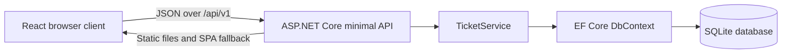

# Current implementation architecture

## Overview

The primary delivery is now a portable Windows application: a WPF shell displays React in a bundled WebView2 runtime and owns the ASP.NET Core host. The existing Docker server remains available. See [ADR 0002](0002-windows-desktop.md) and [Windows instructions](../windows-desktop.md). The browser client and API remain separate source projects; ASP.NET Core serves the compiled client in both hosts.

## Runtime components

### Browser client

`src/AiAgileBoard.Client` is a React and TypeScript application built by Vite.

- `App.tsx` performs lightweight path matching. `/tickets/{id}` opens the ticket detail page; every other path opens the ticket list.
- `pages/TicketsPage.tsx` fetches all tickets, calculates dashboard totals in the browser, renders loading/empty/error states, and opens the creation modal.
- `modals/TicketCreateModal.tsx` manages the create form and posts a new ticket to the API.
- `pages/TicketDetailPage.tsx` fetches one ticket and sends full editable-field updates with `PUT`.
- `tickets.ts` defines the browser-side ticket shape and the ordered list of workflow state display names.
- `styles.css` contains the shared responsive presentation.

The client deliberately has no state-management or routing dependency. Page state is local React state, navigation uses normal links, and server data is read with the browser `fetch` API.

### HTTP API

`src/AiAgileBoard.Api` is an ASP.NET Core 10 minimal API.

- `Hosting/BoardHost.cs` configures JSON string enums, EF Core with SQLite, static files, migrations, `/api/v1`, and the single-page-app fallback. Both the server entry point and desktop shell use it.
- `Api/TicketsApi.cs` maps health-independent ticket routes and translates domain entities into stable response records.
- Invalid ticket input is returned as an HTTP 400 validation problem; missing tickets return HTTP 404.

The current API has no authentication, authorization, OpenAPI document, rate limiting, or concurrency contract.

### Application service

`Application/TicketService.cs` contains the implemented ticket use cases:

- retrieve one ticket with its state and comments;
- compose and execute a no-tracking ticket query;
- validate, normalize, and persist a new ticket;
- validate and update the editable fields of an existing ticket.

The service resolves states from seeded database records. A new ticket may identify a state by positive ID, by name, or by both; when both are provided they must match. The update endpoint currently identifies state by name.

### Domain model

The current model contains four types:

| Type | Important fields | Notes |
| --- | --- | --- |
| `Ticket` | GUID ID, title, description, story points, assignee, state, comments | Root entity for the implemented workflow. |
| `State` | integer ID, unique name, `HumanNeeded` | Ten records are seeded by the migration. |
| `TicketComment` | GUID ID, ticket ID, body | Created only as part of initial ticket submission; deleted with its ticket at the database level. |
| `Assignee` | `Human`, `Agent` | Stored as a string in SQLite and serialized as a string in JSON. |

The domain classes currently act as persistence entities. A transition state machine, leases, activity records, projects, users, and agent identities have not been added.

### Data layer

`Data/AgileBoardDbContext.cs` configures entity relationships and constraints. `Data/Migrations/20260904023000_InitialTicketSchema.cs` creates:

- `States`, with a unique state name;
- `Tickets`, with a restricted foreign key to `States`;
- `TicketComments`, with a cascading foreign key to `Tickets`.

At application startup, the database directory is created and `Database.Migrate()` applies pending migrations. The default repository configuration uses `data/aiagileboard.db`; the production image overrides it with `/app/data/aiagileboard.db`.

## Request flows

### Create a ticket

1. The user completes the modal form.
2. The client posts the editable fields, selected state, assignee, and optional initial comment.
3. `TicketService` validates required text, non-negative story points, the assignee enum, and the requested state.
4. The service assigns GUIDs, trims text, discards blank comments, and saves the object graph.
5. The API returns HTTP 201 and the client appends the ticket to the in-memory list.

### Edit a ticket

1. A normal browser link opens `/tickets/{ticketId}`.
2. The client fetches the ticket and copies editable fields into a draft.
3. Saving sends a `PUT` request with all editable fields.
4. The service updates the stored ticket while retaining its ID and existing comments.
5. The page replaces its draft with the saved response.

Updates are last-write-wins. There is no optimistic concurrency version or partial-update endpoint yet.

## Hosting and build

The Dockerfile has these meaningful targets:

| Target | Purpose |
| --- | --- |
| `frontend-build` | Installs locked npm packages and creates the Vite production bundle. |
| `frontend-test` | Runs frontend lint and component tests after building. |
| `backend-dependencies` | Restores .NET projects and copies backend sources. |
| `backend-test` | Compiles and runs the .NET solution tests. |
| `backend-build` | Copies the frontend bundle into `wwwroot` and publishes the API. |
| `runtime` | Runs the combined application as a non-root user on container port 8080. |

The image declares `/app/data` as a volume. Binding host port `127.0.0.1:8080` keeps the normal local run accessible only from the host machine.

## Test coverage

- Backend integration tests exercise health, ticket creation, invalid state handling, state conflict handling, listing, retrieval, updating, missing tickets, persistence, comments, and composable service queries.
- Each backend integration-test factory uses its own temporary SQLite database and deletes it after the fixture is disposed.
- Frontend component tests exercise ticket rendering, creation-dialog opening, ticket-detail rendering, editing/saving, and the not-found state.
- The unit-test and end-to-end projects are scaffolds and do not yet validate domain transitions or full browser-to-database workflows.

## Known architectural gaps

The main gaps between this prototype and the target architecture are documented in the [implementation status](../README.md#implementation-status). The highest-impact gaps are authentication, agent claim/lease semantics, enforced transition rules, audit history, projects/boards, concurrency control, and API contract generation.
